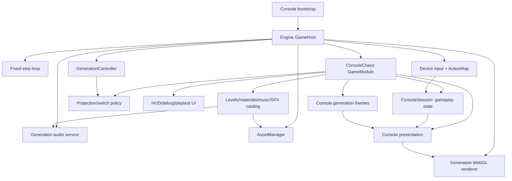

# Console Chaos Engine — 完全移行計画書

> 本書は、`apps/console-chaos` に残る世代別基盤機能を `@console-chaos/engine` へ完全移行するための是正計画である。
> `ENGINE_PLAN.md` と `IMPLEMENTATION_PLAN.md` を置き換えるものではなく、現行実装と目標設計の差分を閉じることに特化する。
>
> 作成日: 2026-08-11
>
> 仕様の優先順位は **`ENGINE_PLAN.md` > `IMPLEMENTATION_PLAN.md` > 本書 > 実装中の補助文書** とする。

---

## 1. 背景と結論

現行 workspace には、独立した `@console-chaos/engine`、`GameHost`、`GameModule`、境界検査が存在する。
しかし Console Chaos の実ブラウザ経路は `bootstrap.ts` から旧 `main.ts` を読み込み、app 内の loop、generation、input、render、audio を組み立てている。
`createConsoleChaosModule()` は本番 bootstrap から使用されておらず、engine API を利用する最小アダプタとして並存しているだけである。

したがって現在地は「再利用可能な engine の成立」までは完了しているが、
「Console Chaos 本編をその engine 上へ完全移行する」作業は未完了である。

本計画の目的は次の一文で定義する。

> Console Chaos の本番・デバッグ・テスト経路を単一の `GameHost` 上へ統合し、app からゲームジャンル非依存の世代機能と互換層を削除しても、現行の状態、映像、音声、操作、URL、アセット、性能を維持する。

### 1.1 「完全移行」の意味

完全移行後は、次の各項目に正本が一つだけ存在する。

| 項目 | 唯一の正本 |
|---|---|
| 固定 60 Hz loop、visibility、catch-up | engine `GameHost` / platform |
| hardware generation profile | engine `HARDWARE_GENERATION_PROFILES` |
| 現世代、切替、キュー、強制切替、blend、無敵 | engine `GenerationController` |
| keyboard/gamepad の物理状態と世代入力制約 | engine input |
| 4世代のFBO、generation pass、CRT、切替合成 | engine WebGL renderer |
| glTF/image/GPU resource lifetime | engine `AssetManager` |
| 音楽clock、voice source、voice limit、世代音質切替 | engine audio |
| Console固有のcamera/action/player/art差 | app `ConsoleChaosGenerationTheme` |
| puzzle、checkpoint、hint、投影時位置解決 | app gameplay/policy |
| 曲、編曲、SFX ID、material、asset catalog | app content/presentation |

---

## 2. 現状の差分台帳

### 2.1 移行が必要な残存機能

| ID | 現在の残存箇所 | 問題 | 目標 | 完了時の処置 |
|---|---|---|---|---|
| D-01 | `src/bootstrap.ts` → `src/main.ts` | 本番が `GameHost` を使わない | bootstrap が host を構築し Console `GameModule` を起動 | 旧 `main.ts` を削除 |
| D-02 | `generation/profiles.ts` | hardware と game theme が700行の一体型 | hardware は engine、theme は app の独立定義 | `PROFILES` と互換合成を削除 |
| D-03 | `generation/switcher.ts`, `transition.ts` | engine とappに2つの状態機械 | engine controller だけを使用 | 2ファイルを削除 |
| D-04 | `render/pipeline.ts`, `postfx/**`, `quantize/**` | 汎用の世代表現がapp所有 | engine generation rendererへ移動 | app側実装とshader重複を削除 |
| D-05 | `render/renderer3d.ts` | generic pass と作品asset処理が950行に混在 | engine pass + app presentation/catalog | monolithを削除 |
| D-06 | `render/frame.ts` | player/torch/plane/backdrop 固定field | 平坦な engine `RenderFrame` command | legacy frameを削除 |
| D-07 | `input/mapper.ts`, `constraints.ts`, `source_*` | ActionMap導入後も旧入力経路が本番 | engine DeviceSnapshot + ActionMapのみ | 旧入力層を削除 |
| D-08 | `audio/director.ts` | source選択とhardware品質適用がapp所有 | engine generation audio service | appには曲/SFX変換だけ残す |
| D-09 | `renderer3d.ts` の直接 image/glTF load | `GameContext.assets` を迂回 | AssetManagerで一意取得・解放 | 直接loadを禁止 |
| D-10 | `core/**`, `render/gl/index.ts` 等のre-export | 旧import pathを温存 | appからengine公開entryを直接import | 互換shimを削除 |
| D-11 | `engine_adapter.test.ts` | moduleの存在確認が中心で本番hostを証明しない | production bootstrapと同じhost E2E | shallow testをcontract testへ置換 |

### 2.2 app に残すべき世代関連コード

次は Console Chaos のゲームデザインであり、engine へ移してはならない。

- 世代ごとのcamera rig、移動速度、jump/attack能力、player model/sprite、texture set、backdrop、fog
- `DISPLAY_NAMES`、チャンネル表示、HUD、ヒント文面
- palette、sprite limit、affine plane、depth buffer、dynamic lightを利用する6種のpuzzle成立条件
- 2D投影時にZ衝突を潰す方針、2D→3D吸着、安全位置、落下・checkpoint復帰
- Console固有のlevel schema、puzzle/checkpoint/spawn/hint metadata
- 曲データ、世代別編曲、SFX IDとgame eventの対応
- entity typeからmaterial/model/textureへ対応するcatalog
- playtest flow、記録、debug UI、既存 query URL の意味

重要なのは「世代に関係するコードをappからゼロにする」ことではない。
hardware capabilityの提供と実装はengine、capabilityを使うゲームルールと作品テーマはapp、という境界を守る。

---

## 3. 目標アーキテクチャ



### 3.1 1 fixed tick の順序

1. `GameHost` が `DeviceSnapshot` を取得する。
2. host が `GameInstance.prepareFixedUpdate` を呼び、app の `ActionMap` が Console action を作る。
3. prepare phaseでappがswitch actionをengine `GenerationController`へ要求する。
4. requestが切替前eventを発火し、Console projection policyが位置解決を行う。
5. hostがcontrollerを1tick進め、現世代、transition、blendを確定する。
6. engine audioが同じcontrollerの世代に追従し、音楽位相を維持する。
7. hostが`fixedUpdate`を呼び、現在のhardware profileとapp themeでConsole gameplayを更新する。
8. checkpoint、puzzle、hint、audio cueを更新する。
9. render callbackで`buildRenderFrame`が平坦なcommand bufferを構築する。
10. engine rendererが必要な1世代、切替中のみ2世代を描画する。

世代controller、入力sample、音声profile適用を別のloopで再度実行してはならない。

### 3.2 lifecycle と所有権

| Resource | 作成 | 利用 | 解放 |
|---|---|---|---|
| `GameHost` | bootstrap | browser page | `pagehide` |
| `GenerationController` | host | renderer/audio/module | host dispose |
| `World` | host | ConsoleSession | host dispose |
| ActionMap | Console module | fixed update | module dispose |
| GPU pipeline/FBO/shader | engine renderer | render | renderer dispose/context restore |
| image/glTF/texture handle | AssetManager | renderer commands | module release/host dispose |
| AudioContext/source/clock | engine audio | host + Console audio presenter | audio dispose |
| HUD/debug DOM | Console module/UI | render/update | module dispose |

---

## 4. 非交渉の設計条件

### 4.1 単一性

- browser loop は `GameHost` の1つだけ。
- generation controller は `GameContext.generation` の1つだけ。
- 1 tickにつきdevice pollとActionMap sampleは1回だけ。
- `HARDWARE_GENERATION_PROFILES` はengineの1テーブルだけ。
- 同じcanvasを描くgeneration pipelineは1つだけ。
- 1 app instanceにつきAudioContextとmusic clockは1つだけ。
- 同一URLのasset fetchと同一GPU resource作成を重複させない。

### 4.2 境界

- engineはpuzzle、checkpoint、player、torch、Console固有asset pathを知らない。
- appはFBO、shader compile、CRT signal処理、palette quantization実装を知らない。
- appからのengine importは `@console-chaos/engine` 公開entryだけ。
- Console projection policyをengineの既定動作にしない。
- app themeはhardware値を複製しない。

### 4.3 忠実性

- level JSON、asset binary、puzzle条件、入力配置、既存URLを変更しない。
- state/replay hash、validator、algorithmic goldenは完全一致を原則とする。
- browser画像の閾値変更と実装変更を同じPRで行わない。
- 音楽のbar position、voice limit、PCM基準を維持する。
- 意図的な差分は理由、影響、承認を `PARITY_MATRIX.md` に記録するまで受け入れない。

### 4.4 参照元

- `../Opus5ConsoleChaos` は引き続き読み取り専用とする。
- 各gateで参照元のHEAD、clean状態、`tools/fixtures/reference-snapshot.json`を検査する。
- 参照元でinstall、build、format、asset生成を実行しない。

---

## 5. 必要な engine contract の完成

### 5.1 GenerationController

旧sessionの「入力sample → switch request → transition advance → gameplay」というtick順序を保つため、
`GameInstance` に任意の `prepareFixedUpdate(frame)` phaseを追加する。
`GameHost` は device poll、prepare、controller advance、audio update、fixedUpdate の順に一度ずつ呼ぶ。
prepare phaseはapp actionのsampleとservice requestに限定し、gameplay simulationを進めない。
appからcontrollerの`advance()`を呼ぶことは禁止し、時間を進める所有者はhostだけにする。

現行engine controllerへ、Console本編が旧switcherに依存している次の能力を追加する。

- 通常350ms、強制600ms
- transition中の後勝ち1件queue
- 強制requestをplayer requestで上書きしない優先規則
- 切替前、切替開始、切替完了event
- 強制切替の予告、取消、解除
- 予告残り時間と切替先のread-only状態
- transition中のinvulnerability
- 旧/新2世代とblendをrendererへ渡すread-only view

切替eventには `from/to` のIDだけでなく、両方のhardware profileとdurationを含める。
ConsoleのZ吸着はappのlistenerが処理し、engine controllerへgameplay callbackを埋め込まない。

完了後、`ConsoleSession` はcontrollerを所有せず、`GameContext.generation` を読むだけにする。

### 5.2 Profile と theme

app側の新しい正本を次の形にする。

```ts
interface ConsoleChaosGenerationTheme {
  display: { channel: string; label: string };
  camera: ConsoleCameraTheme;
  action: ConsoleActionTheme;
  player: ConsolePlayerVisual;
  art: ConsoleArtTheme;
  availableActions: readonly ConsoleActionName[];
}
```

`CONSOLE_CHAOS_GENERATION_THEMES` は旧 `PROFILES` から生成せず、appのliteralな正本として定義する。
runtimeでは次の2値を分けて渡す。

- `hardware`: `context.generation.profile`
- `theme`: `CONSOLE_CHAOS_GENERATION_THEMES[context.generation.generation]`

`GenerationProfile` のように両者を恒久的に再結合した型は作らない。
移行中だけ比較用adapterを許可するが、Phase M6で必ず削除する。

### 5.3 Input

engine inputへ、現行Console入力を再現するために不足しているgeneric機能だけを追加する。

- 同値の2軸を最後に操作した軸へ倒すtie-break policy
- keyboard/gamepad deadzoneとdevice間の優先規則
- buttonの`pressed/released/heldMs/value`
- pressure-sensitive profileでのanalog値
- keyboardのfine入力をapp actionとして扱えること
- focus loss時のrelease

action名、buttonの有効/無効、charge、wall jump、attack方向はapp所有とする。
入力buffer/coyote timeをengineへ追加する場合は、action名を知らないgeneric button bufferに限定する。

完全移行後、`ConsoleSession.fixedUpdate` は `ActionSnapshot<typeof CONSOLE_CHAOS_ACTIONS>` を直接受け、
`RawInput`、`Mapper`、`applyConstraints`を経由しない。

### 5.4 RenderFrame と WebGL renderer

engine `RenderFrame` を、Console本編を情報損失なく表せる最小commandへ拡張する。

| Command | 必要な情報 |
|---|---|
| camera | projection、position、target、ortho height/FOV |
| mesh | asset/geometry handle、transform、material handle、layer、visibility |
| skinned mesh | model handle、clip、animation time、tint、front-axis補正 |
| sprite | texture/atlas handle、cell、position、size、flip、alpha cutoff |
| light | position、color、radius、intensity、kind |
| background | sky colors、texture handle、repeat、parallax、placement、brightness |
| material | texture handles、filter、blend mode、shadow flags、UV mode |
| overlay | text/rectとHUD用screen-space情報 |

player、torch、rotating plane、backdropなどの名前をengine型に追加してはならない。
app presentationが上表のgeneric commandへ変換する。

engine WebGL rendererは固定のpass列を持つ。

1. background pass
2. opaque world pass
3. sorted/affine generation pass
4. sprite/billboard pass
5. light/shadow pass
6. palette/signal generation pass
7. CRT postfx pass
8. generation transition compose
9. presentation/overlay

4世代分のshader/FBOは起動時に確保し、通常frameで1世代、transition中だけ2世代を描画する。

### 5.5 AssetManager

AssetManagerへ次のresource typeを統合する。

- JSON/text/binary
- image/bitmap
- glTF/GLB parsed model
- GPU texture/buffer/program/VAO
- sprite atlas metadata

appはasset key/catalogだけを所有し、`Image`、`fetch`、`loadGltf`をrendererから直接呼ばない。
4世代themeで必要なassetをmodule create時にpreloadし、切替時にはloadもGPU allocationも起こさない。

context lost時はCPU側handle/catalogを保持してGPU resourceを再構築する。
releaseとhost disposeの両方をidempotentにする。

### 5.6 Audio

engine audioは次を所有する。

- AudioContextの作成、unlock、master gain、dispose
- phase-stable music clockと先読みscheduler
- voice allocatorとgeneration voice source 4種
- hardware profileに基づくsource、sample rate、reverb、positional、voice limitの適用
- generation switch時のsource変更とbar position維持
- generic score再生とgeneric one-shot request

appは次を所有する。

- song catalogと曲データ
- hardware能力に応じて作る4編曲
- SFX IDとgame eventの対応
- SFX IDからgeneric one-shot requestへの変換

engineは曲名、`jump`、`solve`、`checkpoint`などのSFX IDを知らない。
appの`SOURCE_FACTORIES`表とhardware audio fieldの適用処理はengineへ移す。

### 5.7 Console GameModule

`createConsoleChaosModule()` を本編の唯一の構成点にする。

- `create(context)`でlevel、theme、asset、audio presenter、session、presentation、UIを作る。
- sessionは`context.world`、`context.rng`、generation viewを利用する。
- `prepareFixedUpdate`はActionMapをsampleし、switch requestを発行する。
- `fixedUpdate`は確定済みgeneration viewでgameplayとcue生成を実行する。
- `buildRenderFrame`はarea1の全要素、player、背景、光、影、仕掛け、HUDをgeneric commandへ積む。
- `dispose`はevent listener、DOM、asset handle、ActionMap、app状態を解放する。

headless replayもproductionと同じGameModuleをengine-testkit host上で動かす。
sessionを直接tickするunit testは純粋gameplay検査に限り、統合再生の代用にしない。

---

## 6. 実行フェーズ

### Phase M0 — 現在地の固定と誤判定防止

| ID | 作業 | 成果物 | 受け入れ条件 |
|---|---|---|---|
| M0-01 | 現在のbrowser captureを「legacy runtime baseline」として明示 | parity metadata | runtime、URL、viewport、seed、入力、tickが記録される |
| M0-02 | production bootstrap経路を検査するE2Eを追加 | Console host E2E | `GameHost`/moduleの実起動なしでは失敗する |
| M0-03 | 移行残存物checkerを追加 | `check-console-migration.ts` | legacy importと二重profileを検出できるfixtureがある |
| M0-04 | legacy/engine比較用の一時runtime switchをdev/test限定で設置 | comparison harness | 同じ入力列を両runtimeへ供給できる |
| M0-05 | 現在のreplay/render/audio/perf基準を再取得 | immutable baseline | root verifyと参照snapshotが通る |

一時runtime switchはproduction buildの通常URLから選択できないようにし、M5完了時に削除する。

**Gate MG0:** 旧経路と新経路を区別して測定でき、「旧経路が動いたため移行合格」になる余地がない。

### Phase M1 — Generation と profile の一本化

| ID | 作業 | 成果物 | 受け入れ条件 |
|---|---|---|---|
| M1-01 | prepare phaseとhost tick順序を追加 | two-phase fixed tick | input→request→advance→gameplay順が旧replayと一致 |
| M1-02 | engine controllerへ強制予告・取消・解除・before/after eventを追加 | generation contract | 旧switcher全testをengine testとして合格 |
| M1-03 | Console projection policyをengine eventへ接続 | app switch policy | 2D→3D吸着、安全位置、無敵、強制切替replay一致 |
| M1-04 | app themeを独立したliteralへ移す | Console theme正本 | themeが旧`PROFILES`をimportしない |
| M1-05 | app利用箇所をhardware/theme分離引数へ変更 | typed generation view | appのhardware値重複が0件 |
| M1-06 | sessionから旧switcher所有を除去 | single controller session | 1 tickでcontroller advanceが1回 |
| M1-07 | profile field coverage testを追加 | contract test | 4世代の全hardware fieldと全theme fieldの欠落を検出 |

**Gate MG1:** state replay 10件、switcher全境界条件、6puzzleのsolvable世代が一致し、runtime controllerが1つだけ。

### Phase M2 — Input の一本化

| ID | 作業 | 成果物 | 受け入れ条件 |
|---|---|---|---|
| M2-01 | ActionMapへ最後の軸、deadzone、pressure/held semanticsを追加 | engine input policy | 旧input unitの全caseをengine contractで再現 |
| M2-02 | Console fixedUpdateをActionSnapshot直接入力へ変更 | Console action consumer | `RawInput`への逆変換なし |
| M2-03 | browser/debug/playtestをengine device sourceへ接続 | single input path | keyboard/gamepad両方で既存操作一致 |
| M2-04 | replay harnessをmutable DeviceSnapshotへ変更 | host replay | productionと同じActionMapを通る |
| M2-05 | 旧mapper/constraints/sourceを削除 | cleanup | 禁止import checkerと全testが通る |

**Gate MG2:** 4方向、斜め、analog、fine、pressure、charge、switch queue、focus lossが一致し、入力sampleが1 tick1回。

### Phase M3 — Render command と generation renderer の移行

このフェーズでは、分割、移動、挙動変更を同じPRに混ぜない。

| ID | 作業 | 成果物 | 受け入れ条件 |
|---|---|---|---|
| M3-01 | engine RenderFrameを必要最小commandへ拡張 | render API v2 | Consoleのcontract testが通る |
| M3-02 | legacy Frame→RenderFrame比較adapterを作る | temporary adapter | command列/draw statsのgolden一致 |
| M3-03 | renderer3dをapp内でpass別に分割 | pass modules | 画像、draw order、triangle countが分割前と一致 |
| M3-04 | postfx、CRT、palette、RGB555、transition shaderをengineへ移す | generation passes | algorithmic golden完全一致 |
| M3-05 | background/world/sprite/light/shadow passをengineへ移す | WebGL FrameRenderer | engineがConsole asset/typeをimportしない |
| M3-06 | 4世代FBO事前確保と2世代composeをengine化 | generation pipeline | 通常1世代、切替中2世代、切替時allocation 0 |
| M3-07 | Console presentationをgeneric command生成へ変更 | production frame builder | area1全要素と全演出を表現できる |
| M3-08 | AssetManagerへimage/glTF/GPU lifetimeを統合 | managed assets | 重複fetch 0、release/context lost test合格 |
| M3-09 | engine runtimeをbrowser比較対象へ接続 | engine visual path | CH1〜CH4、切替途中、6puzzle capture合格 |

**Gate MG3:** 旧/新captureの差が基準内、draw stats一致、shader/FBO事前確保、GPU resource leakなし。

### Phase M4 — Audio の一本化

| ID | 作業 | 成果物 | 受け入れ条件 |
|---|---|---|---|
| M4-01 | engine audioへsource factoryとgeneration適用を統合 | generation audio service | 4 sourceとvoice limit test合格 |
| M4-02 | generic score/one-shot APIでConsole曲とSFXを再生 | app audio presenter | engineにConsole SFX IDがない |
| M4-03 | generation eventでsourceと編曲を切替 | phase-preserving switch | bar position誤差1e-9以下 |
| M4-04 | browser unlock/mute/volume/song changeをhost lifecycleへ接続 | web audio lifecycle | 既存B/M操作と設定を維持 |
| M4-05 | app AudioDirectorのhardware処理を削除 | cleanup | OfflineAudio PCM、clip、無音窓基準合格 |

**Gate MG4:** AudioContext/clockが1つ、4世代PCMと切替位相が一致し、10回disposeでnode/resourceが単調増加しない。

### Phase M5 — 本番 runtime の切替

| ID | 作業 | 成果物 | 受け入れ条件 |
|---|---|---|---|
| M5-01 | bootstrapでWebGL renderer/input/audio/hostを構築 | production bootstrap | 通常URLが`host.start(ConsoleModule)`を実行 |
| M5-02 | HUD、開始/終了、設定、playtest loggerをmodule lifecycleへ接続 | Console UI integration | 既存DOM、操作、記録形式を維持 |
| M5-03 | `?scene=` debug/smoke経路をengine host上へ移す | debug module factory | 既存query URLがすべて起動 |
| M5-04 | production相当browser E2Eを追加 | Console E2E | boot、1〜4切替、puzzle、audio unlock、restart、dispose |
| M5-05 | engine runtimeを唯一のdefaultにする | cutover | legacy runtimeを使うproduction path 0件 |
| M5-06 | 一時runtime switchを削除 | cleanup | test/devにも二重runtimeなし |

**Gate MG5:** 実ブラウザとproduction buildがGameHost経路だけで動き、Consoleの全URL・全操作・全表示がparity合格。

### Phase M6 — Legacy と重複コードの削除

| ID | 作業 | 成果物 | 受け入れ条件 |
|---|---|---|---|
| M6-01 | legacy profile/compose adapter削除 | generation cleanup | appにhardware profile literalなし |
| M6-02 | switcher/transition削除 | generation cleanup | appにgeneration状態機械なし |
| M6-03 | legacy Frame/pipeline/renderer/postfx/quantize削除 | render cleanup | appにFBO/shader/CRT実装なし |
| M6-04 | legacy input layer削除 | input cleanup | mapper/constraints/source importなし |
| M6-05 | audio source/engine互換shim削除 | audio cleanup | appはpublic audio APIのみ使用 |
| M6-06 | core/GL/glTF/sort等のre-export shim削除 | import cleanup | appがengine public entryを直接import |
| M6-07 | 未使用shader、duplicate asset、dead debug adapter削除 | repository cleanup | capture/replay/asset hashに未承認差分なし |
| M6-08 | migration checkerを「残存0」modeへ固定 | CI guard | 削除対象を戻すfixtureでCI失敗 |

削除対象の候補は次のとおり。ファイル単位でgame固有コードが混在する場合は先に分割し、必要部分まで削除しない。

```text
apps/console-chaos/src/main.ts
apps/console-chaos/src/generation/switcher.ts
apps/console-chaos/src/generation/transition.ts
apps/console-chaos/src/input/mapper.ts
apps/console-chaos/src/input/constraints.ts
apps/console-chaos/src/input/source_keyboard.ts
apps/console-chaos/src/input/source_gamepad.ts
apps/console-chaos/src/render/frame.ts
apps/console-chaos/src/render/pipeline.ts
apps/console-chaos/src/render/postfx/
apps/console-chaos/src/render/quantize/
apps/console-chaos/src/render/renderer3d.ts
```

`generation/profiles.ts` は単純削除ではなく、app theme型と値を `config/` または `content/` へ移してから削除する。
`audio/music.ts`、`audio/sfx.ts`、`render/material.ts` は作品contentとして残し、必要に応じて `content/` へ移動する。

**Gate MG6:** `P5-04` の条件を満たし、legacy adapterなしで全test/capture/buildが合格する。

### Phase M7 — Hardening と引き渡し

| ID | 作業 | 成果物 | 受け入れ条件 |
|---|---|---|---|
| M7-01 | boundary/migration/public export検査をCIへ固定 | static gates | intentional violation fixtureが必ず失敗 |
| M7-02 | perf、memory、context lost計測 | measurement report | §9の予算内 |
| M7-03 | Console production E2EをCIで実行 | CI matrix | appがengine public APIで合格 |
| M7-04 | `ENGINE_API.md`を実装APIへ更新 | API docs | GameModuleの最小例が再現可能 |
| M7-05 | `PARITY_MATRIX.md`を新runtime結果へ更新 | final parity | legacy baselineとengine resultが区別される |
| M7-06 | reference HEAD/clean/snapshotを最終確認 | immutable reference proof | 531file/基準commitが一致 |

**Gate MG7:** 本書のDefinition of Doneをすべて満たし、旧経路なしでroot `npm run verify` が合格する。

---

## 7. PR 分割と依存順

推奨するPR順は次のとおり。

1. `migration-truth-gates`: M0。新旧runtime識別とCI checker
2. `generation-controller-complete`: M1-01〜M1-03
3. `console-theme-split`: M1-04〜M1-07
4. `console-actionmap-cutover`: M2
5. `render-command-v2`: M3-01〜M3-02
6. `renderer-pass-split`: M3-03
7. `engine-generation-renderer`: M3-04〜M3-06
8. `engine-assets-lifecycle`: M3-08とcontext restore
9. `console-presentation-cutover`: M3-07、M3-09
10. `engine-generation-audio`: M4
11. `console-gamehost-cutover`: M5
12. `console-legacy-removal`: M6
13. `migration-hardening`: M7

各PRは次を必須とする。

- 対象task IDと変更する所有境界
- 旧/新どちらのruntimeで検証したか
- state replay、render capture、audio goldenへの影響
- 追加・削除した公開API
- allocation/resource lifetimeへの影響
- 実行したcommandと結果
- 参照元HEADとclean状態

rendererの「関数分割」「package移動」「shader変更」を同じPRで行わない。
profileの「値変更」と「所有場所変更」も同じPRで行わない。

---

## 8. テストと機械検査

### 8.1 必須テスト層

| 層 | 必須検証 |
|---|---|
| engine unit | generation state machine、input policy、render pass、audio、assets |
| engine contract | GameHost + GameModule + ActionMap + WebGL renderer + audio lifecycle |
| Console unit | player、puzzle、projection policy、checkpoint、hint、content adapter |
| Console host replay | production GameModuleをmanual hostで固定入力再生 |
| Console render golden | 4世代、切替途中、6puzzle、player model/sprite、background、shadow |
| Console audio golden | 4source、PCM、voice limit、switch前後bar position、SFX |
| Browser E2E | production bootstrap、keyboard/gamepad、HUD、URL、audio unlock、dispose |
| Static | imports、legacy file、hardware重複、deep import、game語彙、asset参照 |

### 8.2 production hostを証明するE2E

E2Eは画面が見えるだけでは合格にしない。最低限次を直接確認する。

- document/runtime diagnosticがengine host起動済みを示す。
- `createConsoleChaosModule()` のcreate/fixedUpdate/buildRenderFrame/disposeが呼ばれる。
- generation controllerのinstance数が1。
- 1 tickあたりActionMap sampleが1回。
- 通常frameの描画世代数が1、transition中が2。
- `pagehide`後にloop、input listener、GPU、audio、asset handleが解放される。
- legacy `main.ts`、legacy pipeline、legacy input sourceがbundleに含まれない。

diagnosticはdevelopment/test buildだけに出し、production APIとして公開しない。

### 8.3 `check-console-migration.ts` の検査項目

Phase M6以降、次を機械的に禁止する。

- `apps/console-chaos/src` から `@/core/loop`
- app所有の `createLoop` / `browserHost` 呼び出し
- `generation/switcher`、`generation/transition` import
- `RawInput`、`createMapper`、`applyConstraints`、旧device source
- app内のFBO作成、shader compile、CRT/quantization pass実装
- `Frame.player/torch/plane/backdrop` 固定field
- app内hardware profile keyのliteral重複
- rendererからの直接 `new Image`、`fetch`、`loadGltf`
- pure re-exportだけの互換shim
- Console bootstrapからの旧 `main.ts` import

checker自身に違反fixtureを用意し、検出0件になっただけでは合格にしない。

### 8.4 root verify

最終 `npm run verify` は少なくとも次を含む。

```text
lint / typecheck
engine unit + contract
Console unit + host replay + render/audio golden
Console production browser E2E
boundary check
Console migration check
level/asset/trademark/reference check
engine/testkit/Console production build
performance/resource lifecycle checks
```

---

## 9. 性能・resource予算

| 項目 | 条件 |
|---|---|
| simulation | 60 Hz固定、通常catch-up最大5tick、hidden復帰でcatch-upなし |
| normal render | 描画世代1、CPU/GPU合計16.6ms未満を目標 |
| switch render | 描画世代2は350/600msの期間だけ |
| shader/FBO | 4世代分を起動時作成、switch中作成0 |
| hot allocation | fixedUpdate、RenderFrame build、sortで定常allocationなし |
| asset | 同一URLのfetch 1回、参照数0で解放 |
| lifecycle | boot→disposeを10回行いGPU/Audio/listenerが単調増加しない |
| context lost | world/game stateを失わずGPU resourceを再構築 |
| build | Console bundleにlegacy runtime moduleが含まれない |

計測対象はarea1の最多描画部屋、6puzzle、通常frame、切替途中、audio再生中、debug collider表示中とする。

---

## 10. リスクと対策

| リスク | 兆候 | 対策 |
|---|---|---|
| 新hostが動くが本編は旧host | captureは合格するがmodule lifecycle coverageがない | production host E2Eとbundle禁止検査 |
| controller二重化 | 世代IDやblendが1tickずれる | instance数とadvance回数をcontract testで固定 |
| profile値の欠落 | 特定世代だけ挙動が変わる | hardware/theme全field coverageと旧値golden |
| renderer分割で見た目が変化 | capture差分とdraw順変化 | 分割・移動・変更を別PR、command/draw stats比較 |
| engine APIにConsole語彙が漏れる | player/torch/plane専用型が増える | boundary vocabulary検査とgeneric command review |
| ActionMapで細かな入力差が出る | 4方向tie-break、charge、pressure replay不一致 | old input vectorsをengine contractへ移植 |
| 音源切替で位相がずれる | bar position jump、無音窓 | OfflineAudioとswitch境界test |
| AssetManager化でVRAM leak | switch/再起動でresource増加 | ref-count、dispose10回、context lost test |
| debug URLが移行から漏れる | miniだけ動きsmoke sceneが壊れる | URL matrix E2E |
| 一時legacy経路が恒久化 | runtime flagがproductionに残る | M5 gateでflag削除を必須化 |

問題発生時は直前のgate単位でrevertする。旧runtimeをdefaultへ戻したまま「移行完了」と扱わない。

---

## 11. Definition of Done

次をすべて満たした場合だけ完全移行完了とする。

- [x] Consoleの通常production URLが `GameHost` と `ConsoleChaos GameModule` だけで起動する。
- [x] app sourceに独自loopと第2のgeneration controllerが存在しない。
- [x] hardware generation profileがengineに一意で、appに値の複製がない。
- [x] app themeが旧profileから生成されず、作品側の正本になっている。
- [x] Console gameplayがengine ActionMap snapshotを直接使う。
- [x] 旧RawInput/mapper/constraints/device sourceが削除されている。
- [x] Console本編がengine RenderFrame commandだけを構築する。
- [x] player/torch/plane/backdrop固定fieldを持つlegacy Frameが削除されている。
- [x] FBO、CRT、palette quantization、transition composeがengine所有である。
- [x] `renderer3d.ts` monolithが削除され、generic passとapp presentationの境界が明確である。
- [x] image/glTF/GPU resourceがAssetManager経由で取得・解放される。
- [x] generation audio source選択、voice limit、位相維持がengine所有である。
- [x] engineがConsoleの曲名、SFX ID、puzzle、asset pathを知らない。
- [x] Console projection/puzzle/theme/contentがapp側に留まっている。
- [x] `main.ts`と全legacy adapter/re-export shimが削除されている。
- [x] Console host replayが既存state hashと一致する。
- [x] 4世代、切替途中、6puzzleのrender captureがparity合格する。
- [x] PCM、音楽位相、SFX、voice limitがparity合格する。
- [x] 既存query URL、HUD、設定、playtest/debug操作が維持される。
- [x] Consoleのproduction browser E2Eが合格する。
- [x] dispose/context lost/performance/resource予算を満たす。
- [x] migration checkerが残存0件かつ違反fixtureを検出する。
- [x] root `npm run verify`が旧runtimeなしで合格する。
- [x] `PARITY_MATRIX.md`と`ENGINE_API.md`が実装後の事実に更新されている。
- [x] `../Opus5ConsoleChaos` が基準commitのままcleanで、531file snapshotが一致する。

---

## 12. 完了時の最終報告

最終報告には次を含める。

1. 削除したlegacy fileと互換APIの一覧
2. engineへ追加・変更したpublic contract
3. Consoleが実際に使用するengine service一覧
4. state replay、render capture、audio goldenの結果
5. production E2Eとbundle検査の結果
6. performance、memory、dispose、context lostの計測結果
7. 意図的差分と承認記録
8. 参照元HEAD、clean状態、snapshot検査結果

「全test合格」だけでは完了証跡にならない。
production bootstrapが新hostを使うこと、legacy runtimeがbundleとsourceから消えていること、
Consoleがengine実装を消費していることを、静的検査と実行時検査の両方で示す。
