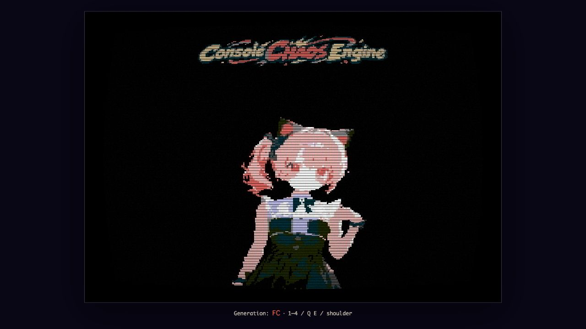
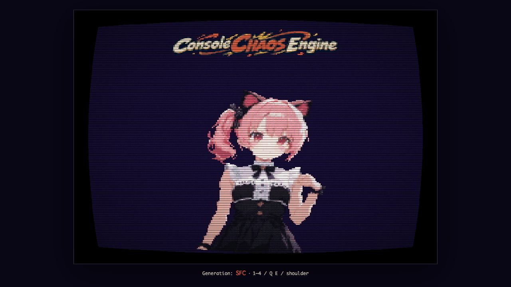
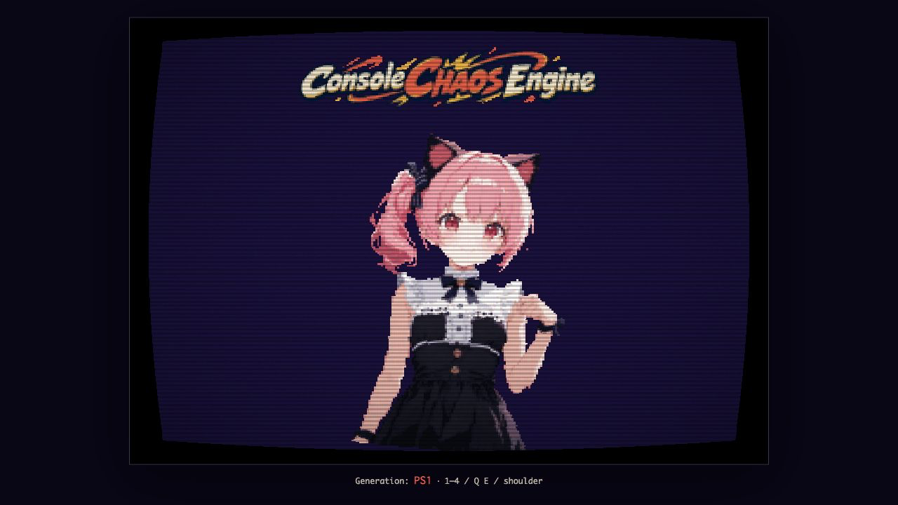
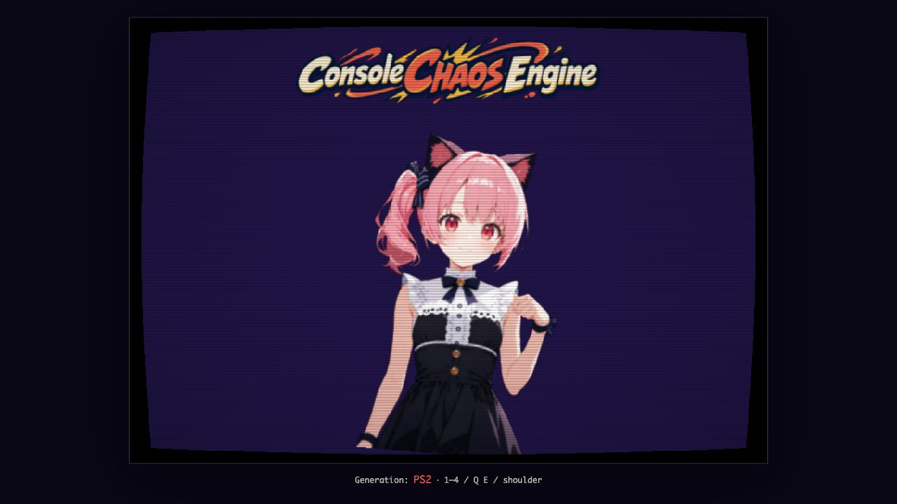

# Asset Pipeline Sample

1枚の世代非依存原画から `@console-chaos/asset-pipeline` で `FC / SFC / PS1 / PS2` 用画像を生成し、Console Chaos Engine の世代別rendererで同じタイトル画面を表示するサンプルです。

## 実行

リポジトリルートで次を実行します。

```sh
npm run build:asset-pipeline
npm run assets:build -w @console-chaos/asset-pipeline-sample
npm run assets:check -w @console-chaos/asset-pipeline-sample
npm run verify -w @console-chaos/asset-pipeline-sample
npm run dev -w @console-chaos/asset-pipeline-sample
```

全workspaceを含む検証は `npm run verify` です。生成済みPNGは直接編集せず、原画または `tools/art.config.mjs` を変更して `assets:build` で再生成してください。

## 操作

- `1 / 2 / 3 / 4`: `FC / SFC / PS1 / PS2` を直接選択
- `Q / E`: 前後の世代へ切替
- ゲームパッド左右shoulder: 前後の世代へ切替
- `?generation=FC|SFC|PS1|PS2`: 初期世代を指定
- `?captureTime=0.5`: 検証用にアニメーション位相を秒で固定し、描画を静止PNGへ凍結

`prefers-reduced-motion` が有効な環境では左右の揺れを停止します。

## 構成

- `art/source`: ImageGen由来の世代非依存原画。runtime bundleには含めません。
- `tools/art.config.mjs`: matte、crop、resample、tone、palette、alphaの変換定義。
- `public/assets/generated`: pipelineだけが生成する8枚のruntime PNGと決定的manifest。
- `src`: Engine公開APIだけを利用するブラウザruntime。asset pipelineをimportしません。
- `tests` / `tools/check-assets.ts`: animation、配置、lifecycle、決定性、palette／alpha契約を検査します。

詳細な設計と完成条件は [Docs/IMPLEMENTATION_PLAN.md](Docs/IMPLEMENTATION_PLAN.md)、原画の生成履歴は [Docs/ASSET_PROVENANCE.md](Docs/ASSET_PROVENANCE.md) を参照してください。

## 検証キャプチャ

4世代とも `captureTime=0.5`、同じcanvasサイズで取得しています。

| FC | SFC |
|---|---|
|  |  |

| PS1 | PS2 |
|---|---|
|  |  |
